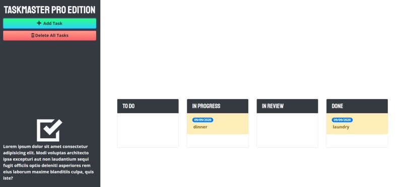

<h1 align="center">Taskmaster Pro Edition</h1>

    
    
    
    

  

    

  

## Table of Contents
- [Description](#description)
- [Installation](#install)
- [Usage](#usage)
- [GitHub](#GitHub)
- [Deployed Site](#Deployed-Site)
- [Questions](#questions)

## Description
Taskmaster Pro Edition is a Application that allows the user to create tasks from "to do" to "done" while saving them in local storage. The user can drag and drop the tasks as they change status or delete them all together as a whole or individually. 
  
## Install
Clone Repo to computer

## Usage
Open index.html

## GitHub  
[Taskmaster Pro Edition Repo](https://github.com/mattkohl82/taskmaster-pro)    

## Deployed Site
[Taskmaster Pro Edition Deployed Site](https://mattkohl82.github.io/taskmaster-pro/) 

## Questions

#### [Mattkohl82 for GitHub](https://github.com/Mattkohl82) 
 
#### mattkohl82@gmail.com for ✉️ email 
